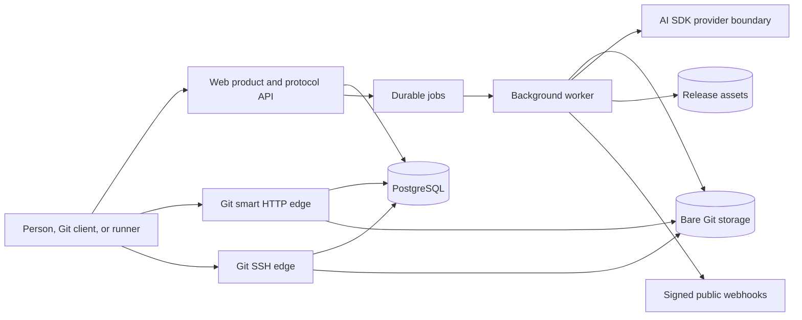

# Architecture

Origin is separated by operational responsibility rather than by pricing tier.
The community edition is a complete forge. Hosted-only code may operate the
forge, but must not become a hidden dependency of the core product.

## Request and work paths

PostgreSQL is the source of truth for identity, collaboration objects, jobs, and
activity. Bare repositories are the source of truth for Git objects and refs.
Both the Git edge and worker mount the same repository root in the single-node
deployment. Cloud deployments can replace that mount with a replicated storage
adapter without changing product routes.

## Security boundaries

- Private repository visibility is checked against workspace membership.
- Git HTTP writes require an access token; token values are never stored.
- SSH commands require a verified signature and are limited to Git upload/receive pack.
- Deploy keys are repository-scoped and read-only unless write access is explicit.
- GitHub migration tokens are sealed with AES-256-GCM before queueing.
- Repository storage keys are slug-validated and resolved inside a fixed root.
- The importer permits only `https://github.com/{owner}/{repository}` inputs.
- Webhook delivery rejects credentials, redirects, and targets resolving to private networks.
- Runner and status mutations require hashed credentials and workspace membership.
- AI analysis receives bounded repository excerpts, never reusable credentials.
- Agent code execution is deliberately absent until isolated workers and policy
  approvals are implemented.

## Edition rule

`ORIGIN_EDITION=community|cloud` selects operational integrations. It cannot
disable source hosting, importing, issues, change review, repository memory, or
agent planning. Cloud modules may provide managed sandboxes, backups, billing,
enterprise identity, and fleet operations.
